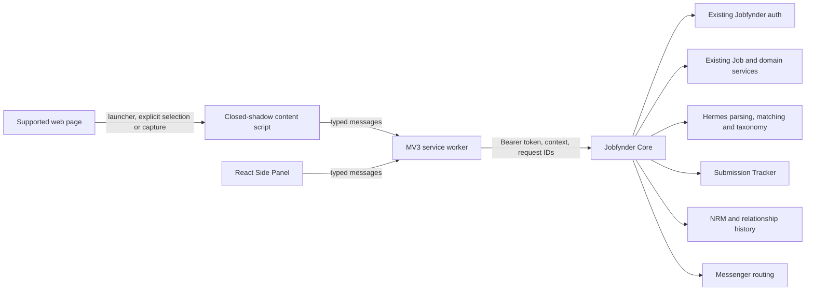

# Jobfynder Chrome Extension: Source of Truth

**Product:** Jobfynder Recruiting Companion
**Extension version:** 0.6.0
**Document status:** Platform documentation mirror of the canonical extension implementation record
**Verified on:** 2026-09-18
**Applies to:** `jobfynder-admin/jobfynder-chrome-extension` and its 0.6.0 Chrome package

This document records what is implemented, how it works, which Jobfynder services it depends on, and what is still unavailable. It is maintained with the release-coupled `SOURCE-OF-TRUTH.md` in the private extension repository. Code-level release evidence in that repository controls if a mirror has not yet been synchronized.

## 1. Release state

Version 0.6.0 is a complete local WXT/React Manifest V3 source and build package. It is a thin Chrome Side Panel client for two Jobfynder roles:

- **Bench Sales Recruiter (`bench_sales`)**: governed capture, matching, submission, relationship, search, work tracking, and Skill Intelligence.
- **Recruiter (`recruiter`)**: governed Skill Intelligence plus Settings and Help. The extension does not grant the BSR workflow to this role.

The local extension build is complete and validated. Its live workflows are available only when the selected Jobfynder Core deployment contains the matching APIs and policy enforcement.

| Component | Current state | Effect |
|---|---|---|
| Extension source and Chrome package | Implemented locally at version 0.6.0 | Can be built, loaded unpacked, and tested |
| Core CORS support, [backend PR #14](https://github.com/jobfynder-admin/jobFynder-BE-nestJS/pull/14) | Merged | The target deployment must include the merge and allow the stable extension origin |
| Core extension bootstrap, [backend PR #15](https://github.com/jobfynder-admin/jobFynder-BE-nestJS/pull/15) | Merged | Supplies earlier bootstrap support |
| Core BSR facade and Skill Intelligence, [backend PR #16](https://github.com/jobfynder-admin/jobFynder-BE-nestJS/pull/16) | Open, mergeable, CI passing, changes requested as of 2026-09-18 | Live BSR and Skills workflows remain deployment-dependent until reviewed, merged, and deployed |
| Hermes Skill Intelligence, [Hermes PR #14](https://github.com/jobfynder/hermes/pull/14) | Merged | Core can orchestrate the canonical skill taxonomy after the target services deploy compatible code |
| Chatwoot identity, [backend PR #9](https://github.com/jobfynder-admin/jobFynder-BE-nestJS/pull/9) | Open and conflicting as of 2026-09-18 | Does not block the extension's current Help links; blocks a future authenticated Chatwoot identity integration |
| Pulse publication | Deliberately disabled/deferred | Capture never publishes to Pulse |
| Network creation/publication | Deliberately disabled/deferred | Capture never creates or publishes a Network record |

The extension must fail closed when Core does not expose the extension facade. Signing in can succeed while workspace bootstrap returns **“The extension API is not enabled on this Core deployment.”** This is a deployment state, not an instruction to fall back to generic Job APIs.

## 2. Product boundary and invariants

The implemented workflow is:

> Capture → Understand → Deduplicate → Match My Bench → Submit → Track → Communicate → Follow Up → Record Outcome → Strengthen Relationship Intelligence

Capture is an entry point into the existing Jobfynder platform. The extension does not become a second system of record.

The following invariants are mandatory:

1. All captured data starts private in an authorized personal or organization context.
2. Capture does not mean publish, share, submit, assign, represent, message, add to Network, or post to Pulse.
3. Core is authoritative for identity, membership, scopes, ownership, assignment, relationship rights, data visibility, policy, and record state.
4. Hermes is called by Core. The browser never calls Hermes directly.
5. The browser never performs authoritative parsing, matching, deduplication, relationship scoring, or submission authorization.
6. The BSR role is only an entry gate. A role name by itself does not grant access to a context, entity, or action.
7. Each write is reauthorized by Core at execution time. A visible button is not authorization.
8. The implementation does not replace or change the existing Job model, job creation rules, Submission Tracker, NRM, Messenger, Pulse, or Core authentication model.
9. Existing generic Job endpoints are not used as an unsafe compatibility fallback.
10. LinkedIn support is manual and guarded. The extension does not navigate, click, crawl, scrape in the background, or make LinkedIn requests automatically.

## 3. Architecture



### 3.1 Extension components

| Component | Source | Responsibility |
|---|---|---|
| WXT configuration | `wxt.config.ts` | Manifest V3 metadata, stable ID key, permissions, content-script matches, Side Panel behavior, and configured Core origin |
| Service worker | `entrypoints/background.ts` | Authentication adapter, trusted-message boundary, active-tab checks, page extraction, selected-text dispatch, Core calls, storage, context menu, site state, rate limiting, and Skill Intelligence modes |
| Page content script | `entrypoints/launcher.content.ts` | Animated launcher, selected-text card, optional page skill highlights, and safe UI isolation |
| Side Panel | `entrypoints/sidepanel/`, `src/App.tsx` | Authenticated role-aware workspace and explicit user workflows |
| Core client | `src/core.ts` | Token lifecycle, HTTPS-only requests, endpoint routing, headers, validation, timeouts, and error mapping |
| Contracts | `src/contracts.ts` | Runtime Zod validation for commands and Core DTOs |
| Selection classifier | `src/selection.ts` | Local deterministic classification and a maximum of three contextual actions |
| Demo bridge | `src/demo.ts` | Fictional, in-memory Recruiter and BSR scenarios with no Core or Hermes request |
| Support UI | `src/Support.tsx` | Help links, email feedback, FAQ, and local privacy-safe diagnostic download |

### 3.2 Trust boundaries

- Tokens exist only in the extension service worker's `chrome.storage.session` area.
- Page JavaScript and page DOM cannot access the token store.
- The launcher uses a closed Shadow DOM and receives only a bounded workspace label.
- Launcher messages must come from the packaged extension ID, the top frame, an allowed URL, and a real tab.
- Privileged panel commands must originate from the exact packaged Side Panel URL.
- Commands are parsed through a finite Zod command union. There is no arbitrary URL or arbitrary fetch command.
- The service worker re-reads Core capabilities and checks the selected context and scope before an operation.
- Core repeats the full authorization decision using authoritative data.

## 4. Manifest, browser support, and permissions

The generated extension has these properties:

- Manifest V3.
- Minimum Chrome version 116.
- Stable extension ID: `fdllhhojlinhledbflifckgacpbfaeil`.
- Default Core origin: `https://uat.jobfynder.com`.
- The Core origin can be changed at build time with `WXT_CORE_ORIGIN`; it must be one exact HTTPS origin.
- Toolbar action opens the Side Panel.
- Content Security Policy: `script-src 'self'; object-src 'none'; base-uri 'none'`.
- Icons: 16, 32, 48, and 128 pixels.
- The supplied Jobfynder SVG logo is used without changing the brand artwork.

### 4.1 Required permissions

| Permission | Reason |
|---|---|
| `sidePanel` | Opens the persistent right-side Jobfynder workspace |
| `activeTab` | Binds an explicit user action to the current tab |
| `tabs` | Reads the active URL/title, classifies site state, and confirms the tab did not navigate during capture |
| `scripting` | Executes bounded extraction only after an explicit capture action and can reinject the launcher after access changes |
| `storage` | Stores the ephemeral token session, pending handoffs, safe preferences, cache, and aggregate local telemetry |
| `contextMenus` | Adds **Send selected text to Jobfynder** |

### 4.2 Host access

The package declares HTTP and HTTPS host access so the floating reminder can appear without requiring the toolbar icon first. It also declares the exact Core and Jobfynder web origins.

Broad host declaration does not authorize automatic extraction or transmission. Chrome can narrow access per site. The extension reports the active site as:

- `active`: Chrome has granted access for the exact origin.
- `not_active`: the page type is supported, but Chrome site access is unavailable.
- `unsupported`: the page is not an ordinary supported HTTP/HTTPS page.

The extension excludes the Chrome Web Store and cannot run on Chrome internal pages. Tabs already open during install or update usually need a reload before the content script appears.

The current UI cannot programmatically grant or revoke optional access because these origins are declared host permissions. **Enable** explains how to allow access in Chrome settings; **Disable** directs the user to Chrome extension settings.

## 5. Authentication and session management

### 5.1 Current Core token flow

The extension uses Jobfynder's existing bearer-token authentication, not session-cookie or CSRF authentication:

| Operation | Endpoint | Behavior |
|---|---|---|
| Sign in | `POST /api/auth/login` | Sends normalized email and password; receives access token, refresh token, and user |
| Refresh | `POST /api/auth/refreshToken` | Rotates the refresh-token family |
| Sign out | `POST /api/auth/logout` | Revokes the supplied refresh token/session |
| Current user contract | `GET /api/auth/me` | Existing Core verification endpoint; the present extension bootstrap primarily relies on token response plus extension capabilities |

All authenticated requests use `Authorization: Bearer <access-token>`. Requests use `credentials: omit`, `redirect: error`, `cache: no-store`, JSON bodies, and a 25-second timeout.

### 5.2 Token storage and rotation

- The access/refresh pair is stored under `jobfynder.session` in `chrome.storage.session`.
- The service worker sets storage access to `TRUSTED_CONTEXTS`.
- Tokens clear when the browser session ends, the extension is disabled/updated, or the session is explicitly cleared.
- Access expiry comes from the JWT `exp` claim when valid; otherwise the client uses a conservative 14-minute fallback.
- Refresh starts when fewer than 45 seconds remain.
- Concurrent refresh callers share one refresh promise, preventing rotation races.
- A refresh with an uncertain result clears the local session. The client does not retry a rotating refresh token.
- Logout clears local credentials first, then requests Core revocation.
- If server revocation cannot be confirmed, the UI states that the local sign-out completed and advises revoking the device in Jobfynder.
- A newly authenticated account with an unsupported role is immediately logged out/revoked and rejected.

### 5.3 Future authentication improvement

The current email/password adapter exists because no verified browser-to-extension exchange is available. The preferred future flow is a Core-owned authorization page followed by a one-time, PKCE-bound extension exchange. It should produce the same Jobfynder access/refresh session family, bind the session to an extension client ID, support device listing and revocation, and never place tokens in a redirect URL. This is not implemented in version 0.6.0.

## 6. Authorization, roles, contexts, and governance

### 6.1 Role behavior

| Role | Implemented experience |
|---|---|
| Bench Sales Recruiter | Home, Capture, Matches, Skills, Search, Work, Settings, Help, subject to Core scopes and entity capabilities |
| Recruiter | Skills, Settings, Help, subject to Core scopes |
| All other roles | Authentication is rejected and the newly issued session is revoked |

### 6.2 Server scopes

The v2 contract can return these BSR scopes:

- `home:read`
- `search:read`
- `capture:write`
- `capture:commit`
- `capture:discard`
- `context:read`
- `match:read`
- `submission:read`
- `submission:create`
- `relationship:read`
- `activity:create`

Skill Intelligence scopes are:

- `skill:read`
- `skill:search`
- `skill:resolve`
- `skill:extract`

The Side Panel hides tools whose required scope is absent. The service worker checks again before calling Core.

### 6.3 Entity capabilities

Core can independently grant or deny:

- view
- capture
- associate
- edit
- match
- submit
- withdraw submission
- log activity
- message
- request introduction
- share internally
- publish to Pulse
- add to bench
- remove from bench
- view relationship history

The extension consumes these flags for presentation only. Core must repeat the decision at every endpoint.

### 6.4 Context and ownership

Capabilities return the authorized personal and/or organization contexts. The user explicitly selects a context. The extension sends its identifier as `X-Context-Id`; it does not derive a tenant from the page, company name, email domain, or role.

The governance response keeps the following separate:

- owner
- current access
- personal or organization context
- authorization context
- shared state
- Pulse publication state
- Network visibility state
- policy version

The capabilities contract is version 2 and must report `privateCaptureEnforced: true`. The extension refuses to treat capture as live when this invariant cannot be verified.

### 6.5 Private-by-default record behavior

Core PR #16 implements extension captures as existing Jobfynder `DRAFT` Job Posts with a separate `extension_captures` lifecycle record. That lifecycle binds capture ID, actor, context, source hash, idempotency key, record ID, and state.

The server implementation is expected to enforce:

- `shared: false`
- `publishedToPulse: false`
- `visibleOnNetwork: false`
- no public Typesense indexing
- no public detail access while unpublished
- no organization fallback when a personal context is selected
- strict personal/organization separation
- atomic idempotency claim and replay
- recoverable review/discard behavior

No capture creates a Pulse post, Network record, platform user, assignment, representation right, conversation, or submission.

## 7. User interface and responsive design

The Side Panel uses a compact right-side navigation rail. The earlier “Jobfynder Companion V1” header was removed. The compact top context contains the user's initials/name, current role, and authorized context selector.

The navigation entries are:

1. Home
2. Capture
3. Matches
4. Skills
5. Search
6. Work
7. Settings
8. Help

Only authorized entries render. The layout uses wrapping controls, bounded text, narrower padding below 340 px, and one-column quick actions on small widths. It does not rely on a fixed desktop panel width.

### 7.1 Brand palette

| Purpose | Color |
|---|---|
| Workspace background | `#F8FAFC` |
| Cards | `#FFFFFF` |
| Primary action | `#00B95D` |
| Primary text | `#111827` |
| Muted text | `#6B7280` |
| Navigation/header | `#0F172A` |
| Warning | `#F59E0B` |
| Danger | `#EF4444` |
| Border | `#E5E7EB` |

## 8. Floating launcher

The launcher is declaratively injected at `document_idle` on top-level supported HTTP/HTTPS pages.

Implemented behavior:

- Fixed to the right edge at 30% viewport height.
- Closed Shadow DOM isolates styles and DOM internals from the host page.
- Collapsed width 72 px; expanded width 276 px.
- Clicking the logo toggles expansion and collapse.
- Expanded mode shows **Jobfynder**, the cached server-authorized workspace label, **Open workspace**, and **Collapse**.
- **Open workspace** asks the service worker to open the Side Panel from a trusted user click.
- A red close button hides the reminder until the page reloads.
- A grip supports vertical pointer dragging and keyboard movement with Arrow Up/Arrow Down.
- Position is bounded inside the viewport. Version 0.6.0 does not persist the drag position across reloads.
- The logo uses a seven-second reminder animation and halo.
- `prefers-reduced-motion: reduce` disables animation and transitions.
- If Chrome refuses programmatic panel opening, the launcher tells the user to use the toolbar icon.
- The launcher reads no page content to render itself.
- The workspace label is obtained from the authorized context cache and exposes no context ID or credentials.

## 9. Capture and requirement understanding

### 9.1 Entry methods

The source contract supports:

- current page
- selected text
- pasted text

The capture entity contract contains `requirement` and `consultant`. The current Core PR #16 live parser implements the requirement capture path; consultant context is opened from an authorized existing assignment. Demo mode illustrates both entity directions, but production consultant creation must not be inferred from the client contract alone.

### 9.2 Extraction order

For an explicit page capture, the browser uses this bounded deterministic order:

1. JSON-LD whose `@type` is `JobPosting`.
2. Schema.org `JobPosting` microdata.
3. A recognized visible LinkedIn job container.
4. Visible text under `main`, `article`, or `body`.

Known ATS hosts are labeled as `ats-adapter` sources:

- Greenhouse
- Lever
- Workday (`myworkdayjobs.com`)
- Ashby
- SmartRecruiters
- Workable

The ATS label identifies extraction provenance; it does not imply a hidden vendor API integration.

### 9.3 Extraction bounds and hygiene

- JSON-LD script input is capped at 200,000 characters.
- Structured job description is capped at 20,000 characters.
- Normal visible text is capped at 40,000 characters and 25,000 text nodes.
- LinkedIn visible text is capped at 20,000 characters and 8,000 text nodes.
- Title is capped at 300 characters.
- Hidden nodes and `script`, `style`, `noscript`, `nav`, `header`, `footer`, forms, inputs, textareas, selects, and buttons are excluded.
- Nulls and excessive whitespace are normalized.
- The service worker captures only the top frame.
- The active tab URL is checked again after extraction. Navigation during capture aborts the operation.
- Source URLs are sanitized before provenance is produced: credentials and fragments are removed, sensitive query parameters are stripped, and recognized ATS identifiers such as `gh_jid` remain usable for deduplication.

### 9.4 Provenance

Every captured source includes:

- sanitized source URL
- source domain
- capture method (`json-ld`, `microdata`, `ats-adapter`, `dom`, `selection`, or `paste`)
- capture time
- extension version
- optional parser version
- server-generated source/content hash

Core should persist actor, context, policy version, request ID, idempotency key, client version, authorization context, outcome, and denial reason in the existing audit infrastructure.

### 9.5 Parse and review

The browser sends the source to Core only after an explicit parse/action. Core orchestrates Hermes and returns:

- recognized entity type
- High, Medium, or Low confidence
- review warnings
- normalized requirement fields
- existing-record information
- drift information
- governance state
- current entity capabilities

The review UI allows editing:

- title
- company
- location
- work mode
- employment types
- experience level
- rate
- work authorization
- summary
- skills

The user must explicitly save. Save commits a private draft through Core. The extension never interprets review as permission to publish.

### 9.6 Deduplication and drift

Core performs deduplication before commit using authoritative boundaries and identifiers, including normalized ATS/canonical IDs, sanitized source URL, context, and source hash. If a record already exists, the extension shows the permitted canonical record instead of silently creating another.

Drift can identify changed rate, location, skills, title, or status. The extension displays drift for review; it never overwrites the canonical record automatically.

### 9.7 Discard semantics

During review, the command contract and Core facade support `DELETE /captures/:id` for a governed recoverable discard. After a saved capture is shown, the current **Close** action clears the local panel state; it does not delete the saved Core record. This distinction is intentional in the documentation and must remain visible to future implementers.

## 10. Selected-text action system

Selecting at least two characters of visible, non-editable page text opens a Jobfynder-branded action card next to the selection. The card uses a closed Shadow DOM, shows the authorized workspace label, and closes on Escape, outside click, scroll, or loss of selection.

### 10.1 Local classification

The browser classifies the selection locally into one of:

- `TECHNICAL_TERM`
- `SKILL_CLUSTER`
- `REQUIREMENT`
- `PERSON`
- `COMPANY`
- `CONTACT`
- `LOCATION`
- `GENERIC_TEXT`
- `UNKNOWN`

It shows the local confidence and no more than three actions. Classification is a presentation hint only and creates no record.

### 10.2 Action matrix

| Classification | Actions in priority order |
|---|---|
| Technical term | Understand Term; Find Requirements; Match My Bench |
| Skill cluster | Understand Skills; Match My Bench; Find Requirements |
| Requirement | Match My Bench; Capture Requirement; Understand Skills |
| Person | Find Recruiter; Add to Network; Search Jobfynder |
| Company | Find Company; Add to Network; Search Jobfynder |
| Contact | Find Contact; Add to Network; Search Jobfynder |
| Location | Find Requirements; Match My Bench; Search Jobfynder |
| Generic or unknown | Understand Selection; Search Jobfynder; Capture |

### 10.3 Action execution

- **Understand** calls Core Skill Intelligence only after the click and renders compact governed term cards.
- **Match My Bench** parses the selected requirement through Core, then requests its authorized matches.
- **Find Requirements** places the text into a one-time search handoff and opens the panel.
- **Capture** places a one-time source handoff into the Capture workflow.
- **Find Recruiter**, **Find Company**, **Find Contact**, **Search Jobfynder**, and the current **Add to Network** button initiate an authorized Jobfynder search.

Version 0.6.0 does **not** create a Network record from **Add to Network**. That label currently routes to search because Network mutation is deferred. It must not be described as a completed add operation.

The context menu **Send selected text to Jobfynder** supplies a second explicit entry point and opens a review. Pending source/search handoffs are removed after the panel consumes them.

### 10.4 Selected-text privacy and telemetry

- A selection is capped at 40,000 characters.
- Selected text stays local until the user clicks an action.
- Raw selection text, URLs, skill names, people, companies, emails, and phone numbers are not stored in telemetry.
- Local telemetry aggregates event, classification, confidence bucket, action, success/failure, total latency, skill count, and last-seen time.
- Aggregate telemetry retains at most 250 rows and is not transmitted by version 0.6.0.
- A failed action explicitly tells the user that the selection was not published or shared.

## 11. LinkedIn safeguards

LinkedIn is supported after the earlier blanket restriction was removed. The following safeguards are implemented:

- Manual action only.
- No automatic navigation, clicking, crawling, background scraping, or direct LinkedIn API/network request.
- Full-page capture is allowed only on `/jobs` and `/hiring/jobs` routes.
- A visible recognized LinkedIn job container or schema job element must exist.
- Other LinkedIn pages require explicit selected text.
- Smaller 20,000-character and 8,000-node limits apply.
- Capture safety limits block after six events for one tab or 30 LinkedIn events across the extension within the preceding hour.
- Rate state is kept in session storage and updates are serialized to avoid races.
- Page/site Skill Intelligence highlighting is disabled on LinkedIn.
- The selected-text action card and context-menu handoff remain available.
- HTTPS LinkedIn pages are supported; insecure HTTP LinkedIn URLs are rejected by policy.

These controls reduce automation and accidental over-collection. They do not replace the user's obligation to follow applicable platform terms and company policy.

## 12. Skill Intelligence

Skill Intelligence is available to Recruiter and BSR accounts when Core returns the required scopes.

### 12.1 Capabilities

- Resolve up to 100 terms, each capped at 100 characters.
- Search canonical skills with a query capped at 100 characters and a result limit capped at 25.
- Fetch skill detail by a stable canonical ID shaped as `skill_` plus 32 hexadecimal characters.
- Extract requirement intelligence from up to 100,000 characters.
- Display canonical ID/name, matched term, match type, confidence, category, subcategory, definition, recruiter explanation, aliases, typed relationships, related roles, and taxonomy version.
- Display governed Jobfynder counts such as My Bench, available, matching requirements, and mapped-to-Core state when Core supplies them.
- Classify skills as required, preferred, mentioned, or excluded.
- Group the technology stack and display unknown terms for review.

### 12.2 Page highlighting

Modes are:

- Off
- This page
- This site

This-page mode is session-only. This-site mode is stored locally by exact origin. Logout clears both page and site modes and asks open tabs to remove highlights.

Highlighting:

- is opt-in;
- is disabled on LinkedIn;
- sends at most 100,000 characters to the Core skill extraction route;
- processes at most 80 page text nodes and inserts at most 80 markers;
- skips links, controls, editable nodes, scripts, styles, and extension-owned nodes;
- opens a compact skill card when a marker is clicked.

Resolved single technical terms use a local 24-hour cache capped at 100 entries. Cached content is validated against the DTO before use.

## 13. Matching

The extension supports both directions through Core contracts:

- requirement → matching authorized consultants
- authorized consultant assignment → matching requirements

Core filters records before sending canonical fields to Hermes, runs matching with bounded concurrency, and privacy-filters the response. The browser never scores records.

The match UI shows:

- total score
- backend explanation
- tags
- skills score
- experience score
- location score
- work-authorization result
- rate result
- availability
- last-confirmed state when supplied

The list can be filtered by text and by minimum score, including 70, 80, and 90 percent thresholds. Per-entity capabilities determine whether submission or messaging controls render.

## 14. Submission and duplicate prevention

Submission is always a separate, explicit action:

1. The user selects an authorized match.
2. The extension requests submission preflight.
3. Core rechecks requirement, consultant assignment, representation rights, recipient/relationship, projection, and duplicates.
4. The extension displays the exact preview.
5. The user clicks **Submit consultant**.
6. Core rechecks and creates through the existing `BenchSubmissionService`.
7. Core returns submission status, Submission Tracker URL, and whether the separate activity/audit write succeeded.

The preview includes:

- requirement
- consultant
- represented-through context
- recipient
- match score
- included information
- existing submission, if any
- current `canSubmit` state

An existing active submission blocks creation. Both preflight and commit perform duplicate enforcement. Writes use idempotency keys so retrying one intended submission returns the same authoritative result.

The extension does not invent a new Submission model or tracker.

## 15. Company, recruiter, NRM, and activity context

After a capture is saved or deduplicated, Core can return one authorized relationship projection containing:

- company name, industry, website, and permitted requirement count;
- recruiter name, email, and phone when permitted;
- relationship ID, status, tier, trust score, last contact, next follow-up, submission total, and placement total;
- recent submissions and outcomes;
- `canLogActivity`, `canMessage`, and `canSubmit`;
- an authorized Messenger URL.

An exact, unambiguous contact identity is required for recruiter-specific authorization. A company name alone does not authorize relationship history or messaging.

Implemented activity types are:

1. Received Requirement
2. Contacted Recruiter
3. Shared Consultant
4. Submitted Consultant
5. Followed Up
6. Interview Scheduled
7. Interview Completed
8. Offer
9. Placement
10. Rejected
11. Requirement Closed
12. Note

Activity notes are capped at 2,000 characters. Core requires an organization context and writes to the existing relationship/event model. Existing vendor last-contact updates are best effort and remain a Core concern.

## 16. Messenger integration

The extension displays a Messenger action only when Core returns `canMessage: true` and a valid `messengerUrl`. Core PR #16 checks for a matching Jobfynder user with Recruiter or BSR role plus the required relationship context.

Version 0.6.0 opens the existing Jobfynder Messenger route. It does not create a conversation or send a message. A stable query-based or token-based contextual conversation bootstrap has not been verified, so the extension must not claim that the exact recruiter conversation will be selected automatically.

## 17. Home, Search, and Work

### 17.1 Home

For authorized BSR users, Home can show Core-provided:

- attention items such as follow-ups and interviews;
- bench counts such as available, submitted, and interviewing;
- quick links for Capture and consultant search.

### 17.2 Search

Search requires at least two characters and returns grouped authorized results. The client contract recognizes:

- requirements
- consultants
- recruiters
- companies
- submissions
- Pulse
- Network

The current Core PR #16 implementation returns requirements, consultants, companies, and submissions. Recruiter, Pulse, and Network groups may be absent until their governed Core projections exist. No missing group should be synthesized in the extension.

A consultant result can open its authorized context and then reverse-match to requirements.

### 17.3 Work

Work contains:

- the latest submission result and Submission Tracker link;
- relationship/company/recruiter context;
- activity logging;
- authorized Messenger navigation.

## 18. Helpdesk and feedback

The Help tab contains:

- FAQ topics for private capture, LinkedIn safeguards, missing launcher recovery, and site access;
- a link to `https://jobfynder.com/help-center`;
- a link to `https://jobfynder.com/submit-feedback`;
- an email link to `feedback@jobfynder.com`;
- a local diagnostic-report form.

The diagnostic JSON contains only:

- category
- user-entered message
- Jobfynder role
- live or preview mode
- extension version field
- timestamp

It does not attach page content or credentials. The file is downloaded locally and is not sent to Jobfynder.

The current source has two metadata inconsistencies: `src/Support.tsx` writes diagnostic version `0.5.0`, and `src/demo.ts` reports demo extension version `0.5.0`, while the package and production service worker are 0.6.0. This does not affect live authorization or capture provenance, but it should be corrected in the next patch so support reports and demo governance display the release version accurately.

## 19. Fictional test users and preview mode

Preview mode provides two fictional in-memory identities:

| User | Role | Purpose |
|---|---|---|
| Bailey Bench Sales | Bench Sales Recruiter | Exercises the full governed BSR UI and sample lifecycle |
| Riley Recruiter | Recruiter | Exercises the restricted Skill Intelligence experience |

The sample organization is **Meridian Staffing**. Other fictional records include Acme Staffing and Morgan Lee.

Preview mode:

- makes no Core request;
- makes no Hermes request;
- stores no live Jobfynder data;
- uses in-memory captures, matches, relationship context, submission previews, submissions, home metrics, search groups, and skills;
- remains available for UI review when a deployment lacks the extension APIs.

These are not accounts in the production database and no password is provisioned.

## 20. API contract

All extension domain routes are under Core. There is no extension-owned server.

### 20.1 BSR facade

Base path: `/api/extension/v2/bsr`

| Method | Route | Purpose |
|---|---|---|
| GET | `/capabilities` | User, role, contexts, scopes, policy version, and private-capture assertion |
| GET | `/home` | Authorized home metrics and attention |
| GET | `/search?q=` | Grouped authorized search |
| POST | `/captures` | Parse source, deduplicate, detect drift, and create/replay a private review capture |
| POST | `/captures/:id/commit` | Reauthorize and commit edited private draft |
| DELETE | `/captures/:id` | Governed recoverable discard |
| GET | `/captures/:id/matches` | Requirement-to-consultant or governed match projection |
| GET | `/captures/:id/relationship-context` | Company, recruiter, NRM, outcomes, and action capabilities |
| GET | `/consultants/:assignmentId/context` | Authorized existing consultant assignment context |
| GET | `/context/:jobId` | Reopen canonical governed record context |
| POST | `/activities` | Log an authorized relationship activity |
| POST | `/submissions/preflight` | Preview, duplicate check, projection, and current submit authorization |
| POST | `/submissions` | Idempotent explicit submission through existing services |

### 20.2 Skill Intelligence facade

Base path: `/api/extension/v2/skills`

| Method | Route | Purpose |
|---|---|---|
| GET | `/capabilities` | Skills feature availability and taxonomy context |
| POST | `/resolve-batch` | Resolve terms to canonical skills |
| GET | `/search?q=&limit=` | Search canonical taxonomy |
| GET | `/:skillId` | Canonical skill card |
| POST | `/requirements/extract` | Classify requirement skills and technology stack |

### 20.3 Headers and request behavior

| Header | Use |
|---|---|
| `Authorization: Bearer …` | Existing Jobfynder access token |
| `X-Context-Id` | Explicit authorized personal or organization context |
| `X-Request-Id` | Unique trace identifier for each Core request |
| `Idempotency-Key` | Stable ID for the user's intended write |

POST routes accept successful 200 responses in the current Core implementation. DTOs are parsed at runtime before UI state is updated.

## 21. DTOs and compatibility contract

The client validates these main objects:

- `TokenResponse` and session snapshot
- `Capabilities` and `EntityCapabilities`
- `Context`
- `Source` and provenance
- `Capture`
- `Governance`
- `ExistingRecord` and drift
- `Match`
- `SubmissionPreview`
- `Submission`
- `RelationshipContext`
- `Home`
- `SearchGroup`
- `SkillCard`
- `SkillResolveBatch`
- `RequirementSkillIntelligence`
- `SiteStatus`

Breaking DTO changes require a new facade version. Optional additive fields can be added when both Core and Zod contracts handle them safely. The client should not weaken validation to tolerate incompatible server output.

## 22. Local storage inventory

### 22.1 Session storage

| Key | Contents | Lifetime/purpose |
|---|---|---|
| `jobfynder.session` | Access token, refresh token, user, expiry | Trusted contexts only; current browser session |
| `jobfynder.launcher-context` | Bounded workspace label | Lets the launcher show the current authorized context without exposing IDs |
| `jobfynder.pending-source` | One captured/selected source | One-time handoff to the Side Panel; removed on read |
| `jobfynder.pending-search` | One search string | One-time handoff; removed on read |
| `jobfynder.linkedin-capture-rate` | Timestamp/tab event list | One-hour LinkedIn safety window |
| `jobfynder.skill-intelligence-pages` | Tab IDs with page highlighting | Session-only highlighting preference |

### 22.2 Local extension storage

| Key | Contents | Bound |
|---|---|---|
| `jobfynder.skill-intelligence-sites` | Exact origins with site highlighting | Cleared on logout |
| `jobfynder.selection-skill-cache` | Validated single-term SkillCards | 24 hours, maximum 100 entries |
| `jobfynder.selection-telemetry` | Aggregate counters only | Maximum 250 rows |

No captured job, consultant, relationship, submission, message, or Core search result is used as an extension-owned persistent database.

## 23. Error handling and recovery

| Condition | Current behavior |
|---|---|
| Core returns 401 | Session/password message; refresh is attempted only under the defined lifecycle |
| Core returns 403 | Permission failure; action remains denied |
| Core returns 404 for extension route | Shows that the extension API is not enabled on the deployment |
| Core returns 409 | Shows record changed/already exists conflict; does not overwrite |
| Capabilities unavailable after token login | Keeps the auth state understandable and provides workspace-access retry; does not grant scopes locally |
| Unsupported page | Site status is unsupported; no extraction |
| Missing Chrome site access | Explains how to allow the site and reload |
| Tab navigated during capture | Aborts and asks the user to capture again |
| Selected-text action fails | Shows retry and confirms nothing was published or shared |
| Panel cannot open from page | Launcher advises using the Chrome toolbar icon |
| Refresh result uncertain | Clears the local session and requires sign-in |
| Logout revocation uncertain | Clears locally and advises device revocation |

## 24. Security and privacy controls

- HTTPS-only Core origin validation at build time and runtime.
- Exact configured Core origin; no user-supplied request host.
- Bearer tokens isolated from page scripts.
- No cookies or CSRF dependence.
- Redirects rejected.
- Responses parsed and errors normalized.
- Strict command allowlist and sender checks.
- Closed Shadow DOM for launcher and overlays.
- HTML escaping for server/content-derived overlay text.
- Bounded extraction, selection, highlighting, and cache sizes.
- Top-frame-only launcher and extraction.
- Page-navigation race check.
- Sanitized provenance URLs.
- Idempotency keys for writes.
- Explicit context header for tenant/personal boundary.
- Capability checks in UI, service worker, and Core.
- No automatic Pulse or Network action.
- No hidden LinkedIn automation.
- Aggregate local telemetry contains no raw selected content or entity identity.
- Help diagnostics exclude page data and credentials.

## 25. Validation evidence

The 0.6.0 implementation was validated with:

- strict TypeScript compilation;
- 53 Vitest tests passing;
- WXT production build passing;
- WXT Chrome ZIP generation passing;
- production dependency audit with zero known vulnerabilities at validation time;
- browser preview of both roles, launcher behavior, responsive states, capture review, matching, Skills, Search, Work, Settings, and Help.

The validated unpacked build was approximately 441.37 kB.

Existing artifacts recorded before this document was added:

| Artifact | Size | SHA-256 |
|---|---:|---|
| `jobfynder-companion-0.6.0-chrome.zip` | 137,019 bytes | `AB4862FA3A8ED8BD2F00274A00AAA1000A941D2CAA94B2E86FA261D6F00759FE` |
| `jobfynder-companion-0.6.0-source.zip` | 124,344 bytes | `B39F7ADE96CAC8B7C826AE60542947533D40E1DF7FECEDFB3CF5F56EA6A44BA2` |

Those checksums describe the already-produced artifacts. Editing documentation in the source tree does not retroactively change those ZIPs.

## 26. Automated test coverage

The test suite covers the security- and compatibility-sensitive areas, including:

- roles, contexts, scopes, and capability gating;
- token/session behavior and Core request semantics;
- API error mapping;
- source and URL policy;
- LinkedIn URL recognition, route restrictions, and rate limits;
- extraction bounds and site access states;
- selection classification and action resolution;
- privacy-safe telemetry shape;
- capture provenance and governance DTOs;
- matching, submission, duplicate, relationship, and Skill Intelligence contracts;
- responsive/runtime configuration.

Live tenant isolation, server-side denial paths, refresh replay, idempotency races, submission transactions, and Core-to-Hermes failures must also pass the normal backend pipeline after Core PR #16 is merged.

## 27. Known limitations and open work

These items are not complete in version 0.6.0:

1. **Core deployment:** PR #16 must be approved, merged, deployed, and exercised against UAT/production. Until then, live extension facade calls can return 404.
2. **Production denial matrix:** cross-tenant reads/writes, revoked membership, context mismatch, ownership mismatch, private-record public access, refresh replay, duplicate submission, and idempotent retry require normal backend CI and deployment validation.
3. **Observability:** Core-to-Hermes parsing/matching needs production trace and latency/error dashboards.
4. **PKCE exchange:** the preferred Core-hosted one-time extension authorization exchange and device-session UI do not exist.
5. **Messenger targeting:** the current action opens Messenger but does not guarantee automatic selection of the related recruiter conversation.
6. **Feedback transmission:** Help links and local diagnostics exist; the extension does not submit feedback to a new backend endpoint.
7. **Chatwoot identity:** Core PR #9 is unresolved and conflicting; no authenticated Chatwoot identity is wired into the extension.
8. **Pulse:** publication stays disabled until Core has an explicit preview, audience, confirmation, commit, and audit contract.
9. **Network:** **Add to Network** currently searches; it does not mutate Network.
10. **Search groups:** recruiter, Pulse, and Network groups are in the client contract but are not returned by current Core PR #16.
11. **Consultant capture:** the client has a consultant source type, while the current live Core facade is centered on requirement capture and existing authorized assignments.
12. **Saved capture close:** closing the saved view clears local state; it is not a server delete.
13. **Launcher position:** vertical drag position is not persisted across reloads.
14. **Version metadata:** demo and downloaded support report still say 0.5.0 and should be aligned to 0.6.0.
15. **Extension publication:** the extension source directory is not currently a Git repository and has no extension GitHub pull request in this workspace. A Chrome Web Store publication/release process is outside the checked-in implementation.

## 28. Production release gates

Do not describe the live extension as production-ready until all of these are true:

- Core PR #16 is approved, merged, and deployed.
- The deployment includes CORS PR #14 and allows exactly `chrome-extension://fdllhhojlinhledbflifckgacpbfaeil` plus required headers.
- `/api/extension/v2/bsr/capabilities` and `/api/extension/v2/skills/capabilities` return the expected v2 contracts.
- Personal and organization captures remain private and unindexed.
- Cross-tenant, revoked-membership, wrong-context, and unsupported-role cases are denied.
- Access refresh rotation/replay and logout revocation are verified.
- Capture and submission idempotency are verified under concurrent retries.
- Duplicate requirement and duplicate submission behavior is verified.
- Core sends only authorized canonical data to Hermes and privacy-filters returned explanations.
- Submission Tracker and activity outcomes are verified.
- LinkedIn safeguards are exercised in the packaged extension.
- A clean Chrome profile passes sign-in, logout, restart, update, site-access, launcher, Side Panel, and responsive smoke tests.
- The production build uses the intended exact Core origin.
- Release artifacts and checksums are regenerated after any code change.

## 29. Build and local installation

Use Node.js 22.12 or later:

```powershell
npm ci
npm run typecheck
npm test
npm run zip
```

Extract `.output/jobfynder-companion-0.6.0-chrome.zip`. Open `chrome://extensions`, enable Developer mode, choose **Load unpacked**, and select the extracted directory containing `manifest.json`.

For another Core environment:

```powershell
$env:WXT_CORE_ORIGIN = 'https://exact-core-origin.example'
npm run zip
```

`WXT_CORE_ORIGIN` is public build configuration, not a secret. The chosen Core deployment must include the extension APIs and exact CORS origin.

## 30. Maintenance rule

Any future change to roles, permissions, scopes, endpoints, DTOs, storage, capture behavior, privacy state, LinkedIn policy, or deployment dependencies must update this document in the same change. A release should also update:

- `package.json` version;
- production `EXTENSION_VERSION`;
- demo version;
- diagnostic-report version;
- generated package;
- artifact checksums;
- validation counts;
- backend PR/deployment status.

Supporting implementation notes (`README.md`, `AUDIT.md`, `CORE-CONTRACT.md`, `IMPLEMENTATION-REPORT.md`, `SELECTED-TEXT-ACTION-SYSTEM.md`, and `VALIDATION.md`) remain with the extension source. This page is the platform documentation mirror and must be updated with each extension release.
